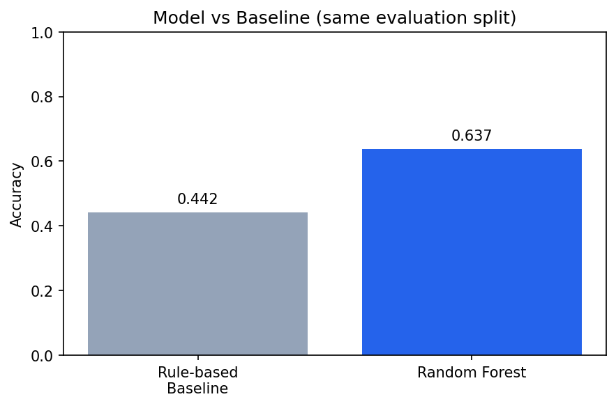
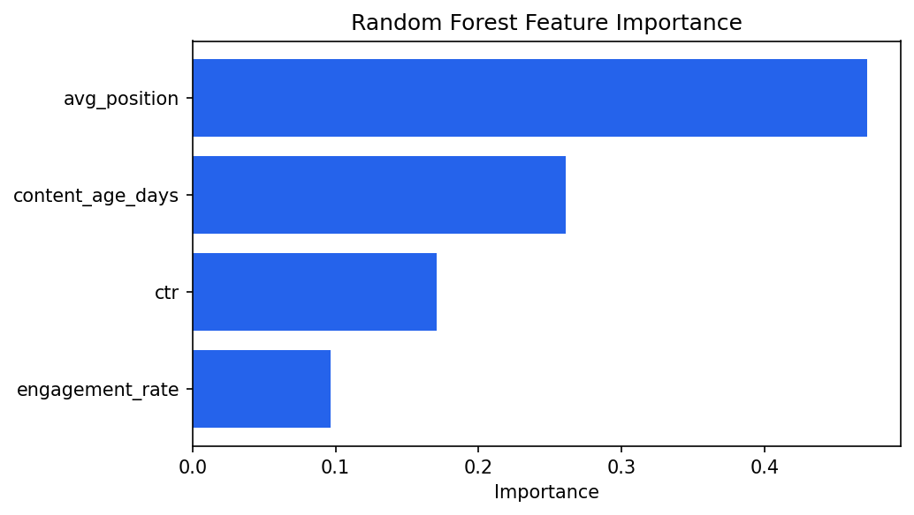

# Refresh Opportunity Scoring for Search Content

## A Machine Learning Approach to Prioritizing Content Review and Refresh

**FlyRank ML Internship — Machine Learning Capstone**  
**Lane:** Refresh / Content Opportunity Scoring

---

## Abstract

This project investigates how search-performance and content signals can help identify pages that may benefit from review or refresh.

Using average search position, content age, click-through rate, and engagement rate, a rule-based baseline was compared with a Random Forest classifier on the same validation split.

The model improved accuracy from 0.44 to 0.64 and achieved a class-1 F1-score of 0.67. Average search position and content age were the strongest predictors.

The resulting ranked action playbook is intended as decision support for content prioritization and should not be interpreted as evidence of causal changes to search rankings.

---

## 1. Research Question

### Main Question

Which observable search-performance and content signals can help identify pages that should be prioritized for content refresh or review?

### Decision Supported

The analysis is designed to help content and SEO teams decide:

- Which pages should be reviewed first?
- Which pages show signals associated with declining performance?
- Which pages may benefit from a content refresh?
- Which pages can be deprioritized for immediate action?

---

## 2. Problem Statement

Large content inventories make it difficult to review every page with equal attention. A useful prioritization system should combine multiple observable signals rather than rely on a single metric.

This project develops a repeatable scoring and machine-learning workflow that ranks content opportunities and assigns recommended actions (Refresh, Review, or Leave). The output is intended for prioritization and decision support rather than causal inference about search-engine algorithms.

---

## 3. Data

The project uses the FlyRank ML Internship search dataset. Analysis is performed at page level using available search and content-performance features.

Relevant variables include:

- Average search position
- Content age
- Click-through rate (CTR)
- Engagement rate
- Trend percentage
- Search impressions and clicks
- Sessions and related performance signals

### Exclusions

Features that could introduce future information, labels, identifiers, or leakage were excluded from the modeling feature set. The project does not publish raw production data, client names, private queries, domains, or credentials.

---

## 4. Methodology

### Feature Selection

The model uses four observable features related to search visibility, content age, click behavior, and engagement. The feature set was defined before evaluation to reduce the risk of using information unavailable at decision time.

### Baseline

A rule-based baseline (Week 4) combines selected signals with manually defined thresholds and produces an action recommendation: Refresh, Review, or Leave.

### Machine Learning Model

A Random Forest classifier was trained as the primary model. It was selected because it can capture non-linear relationships and feature interactions without assuming linearity.

### Validation and Leakage Checks

The model was evaluated on the validation design developed in Week 6 and compared with the baseline on the same split. The feature set was reviewed for future-window information, target leakage, and post-decision variables.

---

## 5. Results

### Model vs Baseline

| Approach              | Accuracy | Precision (class 1) | F1 (class 1) |
|-----------------------|----------|---------------------|--------------|
| Rule-based baseline   | 0.44     | —                   | —            |
| Random Forest         | 0.64     | 0.66                | 0.67         |

The Random Forest improved accuracy from 0.44 to 0.64 and reached a class-1 F1-score of 0.67 on the same validation split. Performance should still be treated as directional rather than production-ready.

### Feature Importance

| Feature           | Importance |
|-------------------|-----------:|
| avg_position      |   0.471    |
| content_age_days  |   0.261    |
| ctr               |   0.171    |
| engagement_rate   |   0.096    |

### Interpretation

Average search position was the strongest predictor (~0.47). Content age ranked second, consistent with the idea that older pages are more likely to need review. CTR and engagement rate contributed smaller amounts of predictive information in this feature set.

These values describe model behavior on the available data and validation design. They should not be read as causal evidence that changing any single feature will improve rankings or traffic.

---

## 6. Validation and Leakage Audit

The final model was evaluated under the validation design established during the audit. Potential leakage sources (future-window information, target-derived variables, post-decision features) were reviewed and excluded.

Validation results provide evidence of model performance within this dataset and evaluation setup. They do not establish that the model causes improved search rankings or that a recommended refresh will increase traffic.

---

## 7. Ranked Recommendations

The model output is converted into a practical content action queue. Each page receives one of three recommended actions based on the strength of its opportunity signals.

### Priority 1 — Refresh

**When to use:** Pages with strong signals of declining or outdated performance (typically high opportunity score combined with weaker average position or older content age).

These pages should receive the highest review priority.

Recommended checks include:

- Content freshness and accuracy of key facts
- Alignment with current search intent
- Coverage of important related topics
- Quality of title and meta description
- Internal linking to and from the page
- Removal or update of outdated information

### Priority 2 — Review

**When to use:** Pages with mixed or moderate signals. The model suggests potential opportunity, but the evidence is not strong enough for automatic action.

These pages should receive human review before any content changes are made. A reviewer should decide whether the page needs a light update, a deeper refresh, or can safely wait.

### Priority 3 — Leave / Monitor

**When to use:** Pages without strong opportunity signals. Current performance does not indicate an urgent need for change.

These pages should not be automatically edited. They can remain under monitoring and be reassessed when new performance data becomes available.

---

## 8. Human Review

The model is a prioritization tool, not an automatic content-editing system. Before acting on a recommendation, a reviewer should check:

1. Whether the page serves a valid search intent.
2. Whether the content is actually outdated.
3. Whether the observed performance change is meaningful.
4. Whether there are technical or external explanations for the change.
5. Whether the recommended action is appropriate for the page.

---

## 9. Limitations

Several limitations should be noted.

- The analysis identifies associations in the available data and does not establish causal relationships.
- Model performance depends on the features, labels, and validation design used.
- Feature importance reflects this particular model and dataset; it is not causal importance.
- A model prediction does not guarantee that a content change will improve rankings, clicks, or traffic.
- Production use would require continued monitoring, periodic re-validation, and human review.

---

## 10. Conclusion

This project developed a repeatable workflow for prioritizing content refresh and review opportunities. A rule-based baseline was compared with a Random Forest model on the same validation split. The model improved accuracy from 0.44 to 0.64 and achieved a class-1 F1-score of 0.67, with average search position and content age as the strongest signals.

The resulting system is best viewed as decision support for human content teams rather than an automated guarantee of search-performance improvement.

---

## 11. Reproducibility

The project was developed incrementally through the following notebooks:

- W01 — Research Question
- W02 — ML Task Framing
- W03 — Data Contract
- W04 — Baseline Action Score
- W05 — Machine Learning Model
- W06 — Validation and Leakage Audit
- W07 — Content Action Playbook
- Capstone — Final Research Analysis

All notebooks are stored in the repository under `work/notebooks/`.

Repository: [https://github.com/AbdullahHasan707/FlyRank-ML-Internship](https://github.com/AbdullahHasan707/FlyRank-ML-Internship)

---

## 12. Acknowledgments and Data Credit

Built on the FlyRank ML Internship dataset.

The dataset and internship project framework were provided by FlyRank.

Data source: [https://flyrank.ai](https://flyrank.ai)
